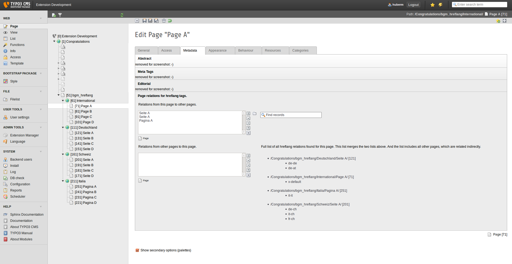

.. ==================================================
.. FOR YOUR INFORMATION
.. --------------------------------------------------
.. -*- coding: utf-8 -*- with BOM.

.. include:: ../Includes.txt

.. _introduction:

Introduction
============

This is an extension to add hreflang meta tags: `<link rel="alternate" hreflang="" href="" />`

I call them hreflang tags! :-)

If you use the sys_languages for countries or if you have just one country with different languages, then there is no
need for this extension. Then you can build the hreflang tags with simple TypoScript.

But if you have multiple countries with multiple languages, then you will need this extension. Because then you will
have one page tree per country ("country branch") and TYPO3 CMS can not connect this country branches automatically.
The editors have to say, which pages from the different country branches belong together.

More information about hreflang tags at Google: https://support.google.com/webmasters/answer/189077

